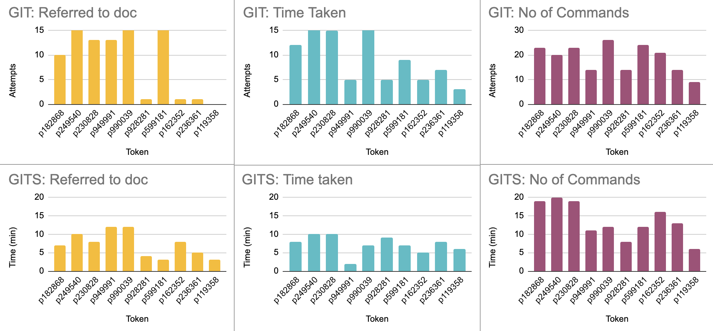

# Results for GITS
 
## Data collection method

* As the project setup is complex for Windows, the testers are required to reserve an Ubuntu instance to ensure an easier setup
* They need to install pip3 on the instance using apt
* After cloning the GITS repository, they install the essential packages using requirements.txt and run the bash script project_init.sh. To ensure gits is successfully installed on the system, the testers can execute the command 'gits hello_world'
* The testers are provided with a pretest, the results of which are used to assess their pre-existing knowledge on Git
* The testers go through the instructions provided and perform the given tasks using Traditional Git, followed by GITS
* The procedure for each tool requires the testers to create a new branch, create a new file, add content to the file and commit to a branch. Meanwhile, the proctor makes a change to the main branch and tester is required to rebase and finally merge the two branches.
* For each of the source control tools, the proctors collect the information regarding the number of commands used to complete the task, the time taken to complete the task and the number of times the tester referred to the source control documentation. 
 
## Challenges Addressed
* To make the implementation process uniform and to avoid any technical difficulty, we made the testers reserve a VCL instance to test the repository.
* We also made sure that each of the testers ran both the commands from traditional git and our gits so that the analysis metrics would be standard
* We also decided to stay on call to assist them with eny technical difficulties even though the documentation was comprehensive.
* There was a small test before the beginning of the debugging session to help us give an idea of the users familiarity with the git syntaxes. 
* To help with the  debug task, we have created a follow me file that answers all the questions: http://tiny.cc/gits
 
## Analysis
The data collected from the lab sessions are tabulated in the this sheet: http://tiny.cc/4tt4tz

# 
 
The key metrics for comparing the traditional Git and the new GITS are:

1. Number of commands executed: Considering the average of the total number of commands run by each tester, we get the following results:

    * Git: 18.8
    * GITS: 13.6

    It is seen that our proposed solution consumes lesser number of commands to perform the same tasks. Looking at the data, we see that there are some cases which has some anomalies. So we propose that median is a better metric than mean to evaluate the methods.

    Median for the number of attempts for all the languages:

    * Git = 20.5
    * GITS = 12.5
 
2. Total time taken to complete the tasks: Considering mean of the total time taken is shown below:
    * Git = 10.3 mins
    * GITS = 7.2 mins

    The corresponding median scores are as follows:
    * Git = 8 mins
    * GITS = 7.5 mins
  
3. Total number of times the candidate referred to documentation: Considering the mean of total number of times the document was referred, we get the following values:
    * Git = 9.2
    * GITS = 7.2
    
    The corresponding median scores are as follows:
    * Git = 11.5
    * GITS = 7.5

Considering both the metrics (1, 2 and 3), it can be concluded that candidates found GITS easier than Git.

# 

 
4. Based on the pretest results and candidates’ feedback: The pretest tested the candidates knowledge of traditional Git with 5 simple questions. The results showed that most people were aware of commands in Git. The results above and the candidates feedback at the end of the session show that most people found GITS better to work with because of the simplicity in doing rebase and syncing branches.
 
5. Based on proctor’s feedback: Based on what we observed on the call, people referred to the documentation more often for GITS and tried doing the tasks on their own for Git. When we spoke to them, we realized that they liked Git because they were used to it but felt that GITS was simpler and reduces a lot of overhead on the user.

## Conclusion
Based on all the metrics shown above, we conclude that GITS is much simpler to use but a lot of users who are familiar with Git do not want to change to GITS except for some commands.
 
## Threats to validity
* Testers have access to the Internet where they can search for answers for the pretest.
* The pretest questioned the candidates on CLI commands and some users use the Git GUI which makes the questions biased towards the CLI tool.
* Some users have more experience using Git than some other users which makes it easier for them and take lesser time to complete the tasks.

## Materials 
1. The data collected during the sessions can be found in: http://tiny.cc/4tt4tz
2. The pretest sheet used to collect tester's knowledge can be found this sheet: http://tiny.cc/jvt4tz
3. The instructions used to guide the lab activity can be found here: http://tiny.cc/kvt4tz
